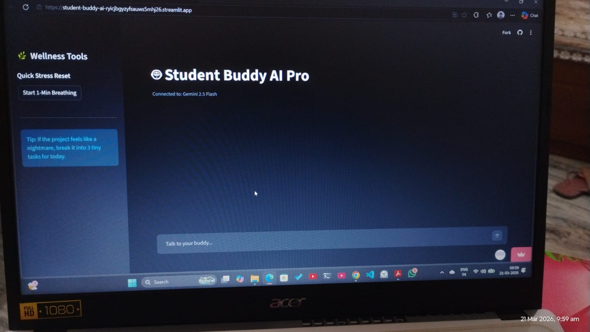
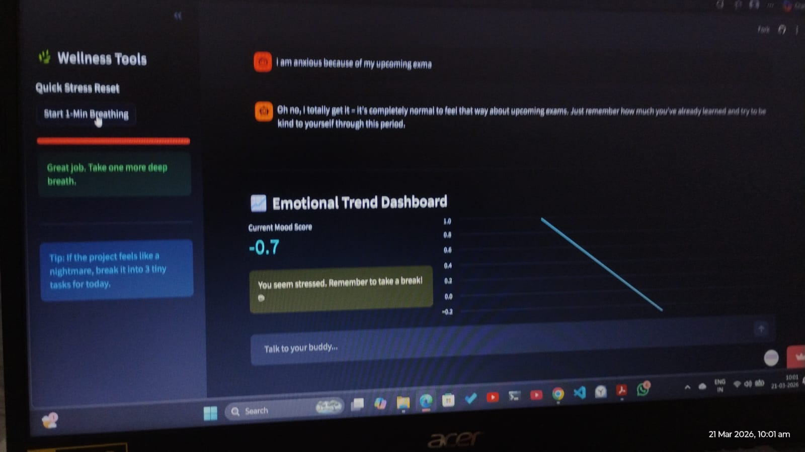
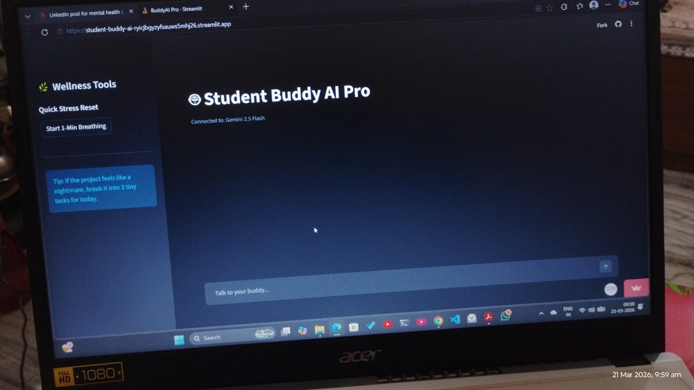
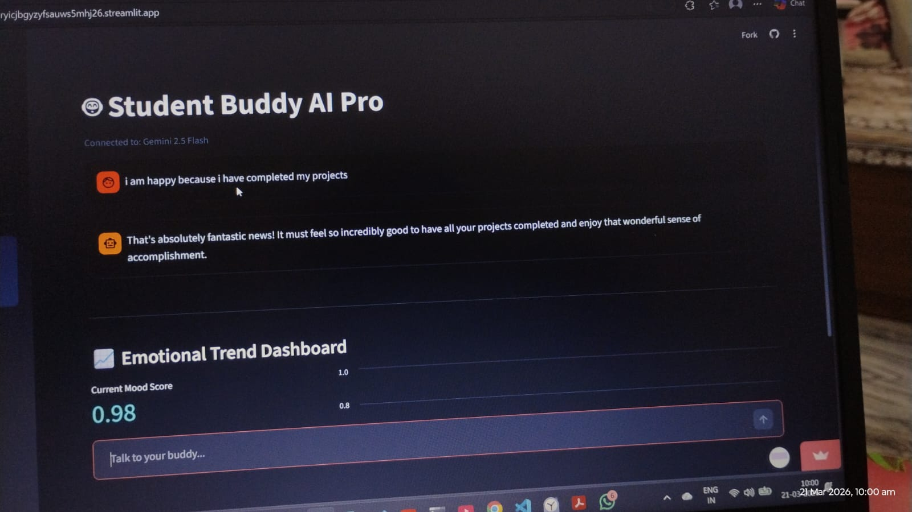

# 🤖 Student Buddy AI Pro

> **Your 24/7 Intelligent Companion for Academic Success and Emotional Well-being.**

[](https://student-buddy-ai-ryicjbgyzyfsauws5mhj26.streamlit.app/)
[](https://deepmind.google/technologies/gemini/)
[](https://python.org)
[](https://aicte-india.org/)

---

## 🌟 Overview

**Student Buddy AI Pro** is a specialized mental health and productivity assistant designed to combat student burnout. Built using **Streamlit** and powered by the **Google Gemini 2.5 Flash** large language model, it provides empathetic support while tracking emotional trends through advanced sentiment analysis.

> 💡 *Built as the capstone project for the AICTE × Edunet Foundation × IBM SkillsBuild — AI & ML Internship (Jan–Feb 2026).*

---

## 📸 Screenshots

### 🏠 Home — Chat Interface


---

### 💬 AI Chat in Action — Empathetic Responses


---

### 📊 Emotional Trend Dashboard — Mood Tracking


---

### 🧘 Breathing Timer + Stress Dashboard


---

## ✨ Key Features

- **🧠 Empathetic AI Chat:** Real-time, human-like conversations tailored to student life — stress, exams, and project pressure.
- **📊 Mood Dashboard:** Automatically visualizes your emotional journey with a live line chart and sentiment metrics.
- **🧘 Zen Tools:** Integrated "Quick Stress Reset" with a guided breathing timer in the sidebar.
- **🚀 Auto-Discovery Engine:** Advanced error handling that ensures a stable connection to the latest Google Gemini models.
- **🛡️ Crisis Support:** Quick-access information for immediate mental health resources.

---

## 🛠️ Tech Stack

| Component | Technology |
|---|---|
| **Frontend** | Streamlit (Python) |
| **AI Engine** | Google Gemini 2.5 Flash API |
| **Sentiment Analysis** | TextBlob |
| **Data Processing** | Pandas |
| **Deployment** | Streamlit Community Cloud |

---

## 🚀 Live Demo

🔗 **Try it here:** [https://student-buddy-ai-ryicjbgyzyfsauws5mhj26.streamlit.app/](https://student-buddy-ai-ryicjbgyzyfsauws5mhj26.streamlit.app/)

---

## ⚙️ Setup & Installation

### Prerequisites
- Python 3.9+
- A Google AI Studio API Key → [Get it here](https://aistudio.google.com/)

### 1. Clone the Repository

```bash
git clone https://github.com/poonam150/Student-Buddy-AI.git
cd Student-Buddy-AI
```

### 2. Install Dependencies

```bash
pip install -r requirements.txt
```

### 3. Configure API Key

Create a `.streamlit/secrets.toml` file:

```toml
GOOGLE_API_KEY = "your_actual_api_key_here"
```

### 4. Run the App

```bash
streamlit run app.py
```

---

## 🗂️ Project Structure

```
Student-Buddy-AI/
│
├── app.py                  # Main application file
├── requirements.txt        # Python dependencies
├── assets/                 # Screenshots
├── .devcontainer/          # Dev container configuration
└── README.md
```

---

## 🎓 About This Project

This project was developed as part of the **6-Week AI & ML Virtual Internship** program:

| | |
|---|---|
| 🏛️ **Organized by** | All India Council for Technical Education (AICTE) |
| 🤝 **Implemented by** | Edunet Foundation |
| 💼 **In collaboration with** | IBM SkillsBuild |
| 📅 **Duration** | 15th January 2026 – 26th February 2026 |

---

## 🤝 Contributing

Contributions, issues, and feature requests are welcome!

1. Fork the repo
2. Create your feature branch: `git checkout -b feature/your-feature`
3. Commit your changes: `git commit -m 'Add your feature'`
4. Push to the branch: `git push origin feature/your-feature`
5. Open a Pull Request

---

## 📬 Connect with Me

Made with ❤️ by **Poonam Kumari Jaiswal**

[](https://linkedin.com/in/your-profile)
[](https://github.com/poonam150)

---

⭐ If this project helped or inspired you, please consider giving it a **star** — it really means a lot!


